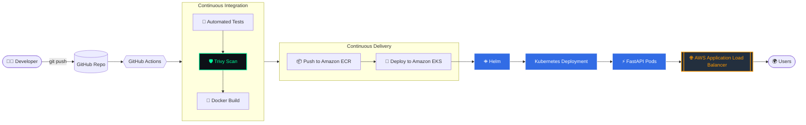
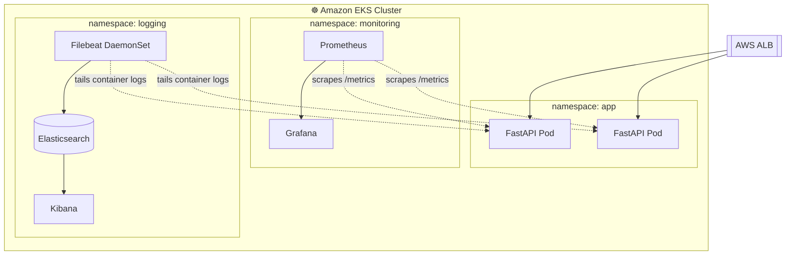

<!-- ═══════════════════════════════════════════════════════════════
     Replace: YOUR_ORG, YOUR_REPO, ACCOUNT_ID, ap-south-1, cluster/app names
     ═══════════════════════════════════════════════════════════════ -->

<div align="center">


<a href="https://git.io/typing-svg">
  
</a>

<br/>


[](https://github.com/YOUR_ORG/YOUR_REPO/actions)

-FF9900?style=flat-square&labelColor=0d1117)


**[Overview](#-overview) · [Architecture](#-architecture) · [Stack](#-tech-stack) · [Quick Start](#-quick-start) · [CI/CD](#-cicd-pipeline) · [Observability](#-observability) · [Cleanup](#-cleanup)**

</div>

---

## 📌 Overview

A production-oriented **DevOps / DevSecOps** project that walks a Python **FastAPI** microservice through its full lifecycle: **build → test → secure → containerize → deploy → monitor** on **AWS Kubernetes (EKS)**.

> [!NOTE]
> The design intentionally avoids unnecessary complexity: **no** service mesh, Kafka, RDS, Redis, Argo CD, or multi-region infrastructure. Every component earns its place.

### ✨ Highlights

| | Feature | Detail |
|---|---|---|
| 🏗️ | **Infrastructure as Code** | VPC, EKS, ECR, and IAM provisioned with Terraform |
| 🔐 | **Keyless CI/CD auth** | GitHub Actions → AWS via **OIDC** (no long-lived access keys) |
| 🛡️ | **Shift-left security** | Trivy scans filesystem & image; pipeline fails on HIGH/CRITICAL |
| 📦 | **Immutable images** | Tagged with the Git commit SHA, stored in Amazon ECR |
| ⎈ | **Declarative deploys** | Helm with `--atomic` auto-rollback on failure |
| 📊 | **Full observability** | Prometheus + Grafana (metrics), Filebeat + Elasticsearch + Kibana (logs) |

---

## 🧭 Architecture

### Delivery Flow



### Runtime & Observability



### Text View

```text
Developer
    │  git push
    ▼
GitHub Repository
    ▼
GitHub Actions ── OIDC ──► AWS IAM Role (short-lived credentials)
    ├── Automated Tests
    ├── Trivy Security Scan
    ├── Docker Build
    ├── Push Image ─────► Amazon ECR
    └── Deploy ─────────► Amazon EKS
                              ▼
                            Helm
                              ▼
                    Kubernetes Deployment
                              ▼
                     FastAPI Application
                              ▼
               AWS Application Load Balancer
```

---

## 🧰 Tech Stack

| Layer | Tooling |
|:--|:--|
| **Application** | Python, FastAPI, Uvicorn, Pytest |
| **Containers** | Docker (multi-stage, non-root), Amazon ECR |
| **Orchestration** | Amazon EKS, Kubernetes, Helm |
| **Infrastructure** | AWS, Terraform |
| **CI/CD** | GitHub Actions, GitHub OIDC |
| **Security** | Trivy (filesystem, image, IaC), IAM least privilege |
| **Metrics** | Prometheus, Grafana (`kube-prometheus-stack`) |
| **Logging** | Filebeat, Elasticsearch, Kibana |

---

## 📁 Repository Structure

```text
.
├── app/
│   ├── main.py                 # FastAPI application
│   ├── requirements.txt
│   └── tests/
│       └── test_main.py
├── Dockerfile
├── terraform/
│   ├── main.tf                 # VPC, EKS, ECR, OIDC provider & IAM role
│   ├── variables.tf
│   └── outputs.tf
├── helm/
│   └── fastapi-app/
│       ├── Chart.yaml
│       ├── values.yaml
│       └── templates/
│           ├── deployment.yaml
│           ├── service.yaml
│           └── ingress.yaml
├── monitoring/
│   └── values-prometheus.yaml
├── logging/
│   ├── values-elasticsearch.yaml
│   ├── values-kibana.yaml
│   └── values-filebeat.yaml
└── .github/
    └── workflows/
        └── ci-cd.yml
```

---

## ✅ Prerequisites

| Tool | Version | Check |
|:--|:--|:--|
| AWS CLI | v2 | `aws --version` |
| Terraform | ≥ 1.6 | `terraform -version` |
| kubectl | ≥ 1.29 | `kubectl version --client` |
| Helm | ≥ 3.14 | `helm version` |
| Docker | ≥ 24 | `docker --version` |
| Python | ≥ 3.11 | `python --version` |

```bash
# Configure AWS credentials for the initial Terraform bootstrap
aws configure
aws sts get-caller-identity
```

---

## 🚀 Quick Start

### 1️⃣ Clone & set variables

```bash
git clone https://github.com/YOUR_ORG/YOUR_REPO.git
cd YOUR_REPO

export AWS_REGION=ap-south-1
export AWS_ACCOUNT_ID=$(aws sts get-caller-identity --query Account --output text)
export CLUSTER_NAME=devops-week2-eks
export ECR_REPO=fastapi-app
export ECR_URI=${AWS_ACCOUNT_ID}.dkr.ecr.${AWS_REGION}.amazonaws.com/${ECR_REPO}
```

### 2️⃣ Run the app locally

```bash
cd app
python -m venv .venv && source .venv/bin/activate
pip install -r requirements.txt pytest httpx
pytest -q
uvicorn main:app --reload --port 8000
```

```bash
curl http://localhost:8000/health
curl http://localhost:8000/metrics
```

### 3️⃣ Provision infrastructure (Terraform)

```bash
cd terraform
terraform init
terraform fmt -check
terraform validate
terraform plan -out=tfplan
terraform apply tfplan
```

Provisions: **VPC · EKS cluster & node group · ECR repository · GitHub OIDC provider · IAM deploy role**

### 4️⃣ Connect kubectl to EKS

```bash
aws eks update-kubeconfig --region $AWS_REGION --name $CLUSTER_NAME
kubectl get nodes
```

### 5️⃣ Install the AWS Load Balancer Controller

Required so the Kubernetes `Ingress` creates an **Application Load Balancer**.

```bash
helm repo add eks https://aws.github.io/eks-charts
helm repo update

helm upgrade --install aws-load-balancer-controller eks/aws-load-balancer-controller \
  -n kube-system \
  --set clusterName=$CLUSTER_NAME \
  --set serviceAccount.create=true \
  --set serviceAccount.name=aws-load-balancer-controller
```

> [!IMPORTANT]
> The controller's service account needs an IAM role (IRSA / EKS Pod Identity) with the official AWS Load Balancer Controller policy. Follow the [AWS guide](https://docs.aws.amazon.com/eks/latest/userguide/aws-load-balancer-controller.html) if your Terraform does not already create it.

### 6️⃣ Build & push the image manually (first run)

```bash
aws ecr get-login-password --region $AWS_REGION \
  | docker login --username AWS --password-stdin ${AWS_ACCOUNT_ID}.dkr.ecr.${AWS_REGION}.amazonaws.com

docker build -t $ECR_URI:local .
docker push $ECR_URI:local
```

### 7️⃣ Deploy with Helm

```bash
kubectl create namespace app --dry-run=client -o yaml | kubectl apply -f -

helm upgrade --install fastapi-app ./helm/fastapi-app \
  --namespace app \
  --set image.repository=$ECR_URI \
  --set image.tag=local \
  --atomic --timeout 5m

kubectl -n app get pods,svc,ingress
```

### 8️⃣ Get the public URL

```bash
kubectl -n app get ingress fastapi-app \
  -o jsonpath='{.status.loadBalancer.ingress[0].hostname}{"\n"}'
```

```bash
curl http://<ALB_HOSTNAME>/health
```

---

## 🐳 Reference Dockerfile

Multi-stage build, non-root user, slim base image.

```dockerfile
# ---------- Build stage ----------
FROM python:3.12-slim AS builder
WORKDIR /build
COPY app/requirements.txt .
RUN pip install --no-cache-dir --prefix=/install -r requirements.txt

# ---------- Runtime stage ----------
FROM python:3.12-slim
ENV PYTHONDONTWRITEBYTECODE=1 \
    PYTHONUNBUFFERED=1

RUN useradd --create-home --uid 10001 appuser
WORKDIR /app

COPY --from=builder /install /usr/local
COPY app/ .

USER 10001
EXPOSE 8000

HEALTHCHECK --interval=30s --timeout=3s --retries=3 \
  CMD python -c "import urllib.request; urllib.request.urlopen('http://localhost:8000/health')" || exit 1

CMD ["uvicorn", "main:app", "--host", "0.0.0.0", "--port", "8000"]
```

---

## 🔐 GitHub OIDC → AWS (Keyless Auth)

GitHub Actions requests a short-lived OIDC token; AWS exchanges it for temporary credentials. **No `AWS_ACCESS_KEY_ID` is ever stored in GitHub.**

### IAM trust policy

```json
{
  "Version": "2012-10-17",
  "Statement": [
    {
      "Effect": "Allow",
      "Principal": {
        "Federated": "arn:aws:iam::ACCOUNT_ID:oidc-provider/token.actions.githubusercontent.com"
      },
      "Action": "sts:AssumeRoleWithWebIdentity",
      "Condition": {
        "StringEquals": {
          "token.actions.githubusercontent.com:aud": "sts.amazonaws.com"
        },
        "StringLike": {
          "token.actions.githubusercontent.com:sub": "repo:YOUR_ORG/YOUR_REPO:ref:refs/heads/main"
        }
      }
    }
  ]
}
```

> [!TIP]
> Scope the `sub` claim to your repo **and** branch (or environment) so no other repository can assume the role.

### Grant the role access to the cluster

```bash
aws eks create-access-entry \
  --cluster-name $CLUSTER_NAME \
  --principal-arn arn:aws:iam::${AWS_ACCOUNT_ID}:role/github-actions-deploy

aws eks associate-access-policy \
  --cluster-name $CLUSTER_NAME \
  --principal-arn arn:aws:iam::${AWS_ACCOUNT_ID}:role/github-actions-deploy \
  --policy-arn arn:aws:eks::aws:cluster-access-policy/AmazonEKSClusterAdminPolicy \
  --access-scope type=cluster
```

### GitHub repository variables

`Settings → Secrets and variables → Actions → Variables`

| Variable | Example |
|:--|:--|
| `AWS_REGION` | `ap-south-1` |
| `AWS_ROLE_ARN` | `arn:aws:iam::123456789012:role/github-actions-deploy` |
| `ECR_REPOSITORY` | `fastapi-app` |
| `EKS_CLUSTER_NAME` | `devops-week2-eks` |

---

## ⚙️ CI/CD Pipeline

`.github/workflows/ci-cd.yml`

```yaml
name: CI/CD

on:
  push:
    branches: [main]
  pull_request:
    branches: [main]

permissions:
  id-token: write   # required for OIDC
  contents: read

env:
  AWS_REGION: ${{ vars.AWS_REGION }}
  ECR_REPOSITORY: ${{ vars.ECR_REPOSITORY }}
  EKS_CLUSTER_NAME: ${{ vars.EKS_CLUSTER_NAME }}

jobs:
  # ─────────────────────────── 1. TEST ───────────────────────────
  test:
    name: 🧪 Test
    runs-on: ubuntu-latest
    steps:
      - uses: actions/checkout@v4
      - uses: actions/setup-python@v5
        with:
          python-version: "3.12"
          cache: pip
          cache-dependency-path: app/requirements.txt
      - name: Install dependencies
        run: pip install -r app/requirements.txt pytest httpx
      - name: Run tests
        working-directory: app
        run: pytest -q

  # ─────────────────────── 2. SECURITY (FS) ──────────────────────
  scan-source:
    name: 🛡️ Trivy (source & IaC)
    runs-on: ubuntu-latest
    steps:
      - uses: actions/checkout@v4
      - name: Trivy filesystem scan
        uses: aquasecurity/trivy-action@0.28.0
        with:
          scan-type: fs
          scan-ref: .
          scanners: vuln,secret,misconfig
          severity: HIGH,CRITICAL
          ignore-unfixed: true
          exit-code: "1"

  # ─────────────────── 3. BUILD · SCAN · PUSH ────────────────────
  build-push:
    name: 🐳 Build, Scan & Push
    needs: [test, scan-source]
    runs-on: ubuntu-latest
    outputs:
      image_tag: ${{ steps.meta.outputs.tag }}
    steps:
      - uses: actions/checkout@v4

      - name: Set image tag
        id: meta
        run: echo "tag=${GITHUB_SHA::12}" >> "$GITHUB_OUTPUT"

      - name: Configure AWS credentials (OIDC)
        uses: aws-actions/configure-aws-credentials@v4
        with:
          role-to-assume: ${{ vars.AWS_ROLE_ARN }}
          aws-region: ${{ env.AWS_REGION }}

      - name: Login to Amazon ECR
        id: ecr
        uses: aws-actions/amazon-ecr-login@v2

      - name: Build image
        run: |
          docker build -t ${{ steps.ecr.outputs.registry }}/${{ env.ECR_REPOSITORY }}:${{ steps.meta.outputs.tag }} .

      - name: Trivy image scan
        uses: aquasecurity/trivy-action@0.28.0
        with:
          image-ref: ${{ steps.ecr.outputs.registry }}/${{ env.ECR_REPOSITORY }}:${{ steps.meta.outputs.tag }}
          severity: HIGH,CRITICAL
          ignore-unfixed: true
          exit-code: "1"

      - name: Push image
        if: github.ref == 'refs/heads/main'
        run: |
          docker push ${{ steps.ecr.outputs.registry }}/${{ env.ECR_REPOSITORY }}:${{ steps.meta.outputs.tag }}

  # ───────────────────────── 4. DEPLOY ───────────────────────────
  deploy:
    name: 🚀 Deploy to EKS
    if: github.ref == 'refs/heads/main'
    needs: build-push
    runs-on: ubuntu-latest
    environment: production
    steps:
      - uses: actions/checkout@v4

      - name: Configure AWS credentials (OIDC)
        uses: aws-actions/configure-aws-credentials@v4
        with:
          role-to-assume: ${{ vars.AWS_ROLE_ARN }}
          aws-region: ${{ env.AWS_REGION }}

      - name: Login to Amazon ECR
        id: ecr
        uses: aws-actions/amazon-ecr-login@v2

      - uses: azure/setup-helm@v4

      - name: Update kubeconfig
        run: aws eks update-kubeconfig --region "$AWS_REGION" --name "$EKS_CLUSTER_NAME"

      - name: Helm upgrade --install
        run: |
          helm upgrade --install fastapi-app ./helm/fastapi-app \
            --namespace app --create-namespace \
            --set image.repository=${{ steps.ecr.outputs.registry }}/${{ env.ECR_REPOSITORY }} \
            --set image.tag=${{ needs.build-push.outputs.image_tag }} \
            --atomic --timeout 5m

      - name: Verify rollout
        run: kubectl -n app rollout status deployment/fastapi-app --timeout=120s
```

### Pipeline Gates

| Stage | Trigger | Fails the build when… |
|:--|:--|:--|
| 🧪 Tests | every push / PR | any test fails |
| 🛡️ Trivy (source) | every push / PR | HIGH/CRITICAL vuln, secret, or misconfig found |
| 🐳 Trivy (image) | every push / PR | HIGH/CRITICAL fixable CVE in the image |
| 📦 Push to ECR | `main` only | – |
| 🚀 Deploy | `main` only | Helm `--atomic` rolls back on failed rollout |

---

## ⎈ Helm Chart Values

`helm/fastapi-app/values.yaml`

```yaml
replicaCount: 2

image:
  repository: ACCOUNT_ID.dkr.ecr.ap-south-1.amazonaws.com/fastapi-app
  tag: latest
  pullPolicy: IfNotPresent

service:
  type: ClusterIP
  port: 80
  targetPort: 8000

ingress:
  enabled: true
  className: alb
  annotations:
    alb.ingress.kubernetes.io/scheme: internet-facing
    alb.ingress.kubernetes.io/target-type: ip
    alb.ingress.kubernetes.io/listen-ports: '[{"HTTP":80}]'
    alb.ingress.kubernetes.io/healthcheck-path: /health

resources:
  requests: { cpu: 100m, memory: 128Mi }
  limits:   { cpu: 500m, memory: 256Mi }

podAnnotations:
  prometheus.io/scrape: "true"
  prometheus.io/path: /metrics
  prometheus.io/port: "8000"

securityContext:
  runAsNonRoot: true
  runAsUser: 10001
  allowPrivilegeEscalation: false
  readOnlyRootFilesystem: true
  capabilities:
    drop: ["ALL"]

livenessProbe:
  httpGet: { path: /health, port: 8000 }
  initialDelaySeconds: 10
readinessProbe:
  httpGet: { path: /health, port: 8000 }
  initialDelaySeconds: 5
```

---

## 📊 Observability

### Metrics — Prometheus + Grafana

```bash
helm repo add prometheus-community https://prometheus-community.github.io/helm-charts
helm repo update

helm upgrade --install kube-prometheus-stack prometheus-community/kube-prometheus-stack \
  --namespace monitoring --create-namespace \
  --set grafana.adminPassword='ChangeMe-Now!' \
  --set prometheus.prometheusSpec.serviceMonitorSelectorNilUsesHelmValues=false
```

Access Grafana:

```bash
kubectl -n monitoring port-forward svc/kube-prometheus-stack-grafana 3000:80
# → http://localhost:3000   (user: admin)
```

Access Prometheus:

```bash
kubectl -n monitoring port-forward svc/kube-prometheus-stack-prometheus 9090:9090
# → http://localhost:9090
```

**Starter PromQL queries**

```promql
# Request rate per pod
sum(rate(http_requests_total[5m])) by (pod)

# 95th percentile latency
histogram_quantile(0.95, sum(rate(http_request_duration_seconds_bucket[5m])) by (le))

# Pod CPU usage
sum(rate(container_cpu_usage_seconds_total{namespace="app"}[5m])) by (pod)
```

### Logs — Filebeat → Elasticsearch → Kibana

```bash
helm repo add elastic https://helm.elastic.co
helm repo update
kubectl create namespace logging

# Elasticsearch (single node — demo sizing)
helm upgrade --install elasticsearch elastic/elasticsearch -n logging \
  --set replicas=1 \
  --set minimumMasterNodes=1 \
  --set resources.requests.cpu=500m \
  --set resources.requests.memory=1Gi \
  --set volumeClaimTemplate.resources.requests.storage=10Gi

# Kibana
helm upgrade --install kibana elastic/kibana -n logging

# Filebeat (DaemonSet — tails container logs from every node)
helm upgrade --install filebeat elastic/filebeat -n logging
```

Access Kibana:

```bash
kubectl -n logging port-forward svc/kibana-kibana 5601:5601
# → http://localhost:5601
```

> [!NOTE]
> The Elastic Helm charts enable security by default. Retrieve the generated credentials with
> `kubectl -n logging get secret elasticsearch-master-credentials -o jsonpath='{.data.password}' | base64 -d`
> and confirm chart settings for your chosen chart version.

**Useful Kibana searches (KQL)**

```text
kubernetes.namespace : "app"
kubernetes.namespace : "app" and message : *error*
```

---

## 🧪 Verification Checklist

```bash
# Infrastructure
terraform -chdir=terraform output

# Cluster
kubectl get nodes -o wide
kubectl get pods -A

# Application
kubectl -n app get deploy,pods,svc,ingress
kubectl -n app logs -l app.kubernetes.io/name=fastapi-app --tail=50
helm -n app history fastapi-app

# Image in ECR
aws ecr describe-images --repository-name $ECR_REPO \
  --query 'sort_by(imageDetails,& imagePushedAt)[-3:].imageTags'
```

- [ ] Terraform applied cleanly
- [ ] Pipeline is green end-to-end
- [ ] Image tagged with commit SHA visible in ECR
- [ ] ALB returns `200` on `/health`
- [ ] Prometheus target is **UP**
- [ ] Grafana dashboards show live data
- [ ] App logs searchable in Kibana

---

## 🔒 Security Practices

| Practice | Implementation |
|:--|:--|
| No static cloud credentials | GitHub OIDC with branch-scoped trust policy |
| Vulnerability gating | Trivy blocks HIGH/CRITICAL on source and image |
| Secret detection | Trivy `secret` scanner in CI |
| Least-privilege containers | Non-root user, read-only FS, dropped capabilities |
| Immutable artifacts | Commit-SHA tags (avoid `latest` in production) |
| Safe rollouts | `helm --atomic` + readiness probes |
| Private images | ECR with scan-on-push enabled |

---

## 🛠️ Troubleshooting

| Symptom | Likely cause | Fix |
|:--|:--|:--|
| `Not authorized to perform sts:AssumeRoleWithWebIdentity` | Trust-policy `sub` mismatch | Verify `repo:ORG/REPO:ref:refs/heads/main` |
| `error: You must be logged in to the server` | Role has no EKS access entry | Run the `aws eks create-access-entry` commands above |
| Pods `ImagePullBackOff` | Wrong repo/tag or node role lacks ECR read | Check `image.repository`, `image.tag`, and node IAM policy |
| Ingress has no ADDRESS | Load Balancer Controller missing / no IAM | `kubectl -n kube-system logs deploy/aws-load-balancer-controller` |
| ALB targets unhealthy | Health path mismatch | Align `healthcheck-path` with your `/health` route |
| Helm `--atomic` rolled back | Failing probes | `kubectl -n app describe pod <pod>` |
| Elasticsearch `Pending` | Insufficient node memory / no storage class | Use larger nodes; confirm the EBS CSI driver is installed |

---

## 🧹 Cleanup

> [!WARNING]
> EKS, NAT gateways, and load balancers **cost money while running**. Destroy everything when you're done.

```bash
# 1. Remove workloads first (deletes the ALB and other AWS-managed resources)
helm uninstall fastapi-app -n app
helm uninstall filebeat kibana elasticsearch -n logging
helm uninstall kube-prometheus-stack -n monitoring
helm uninstall aws-load-balancer-controller -n kube-system

# 2. Empty the ECR repository
aws ecr batch-delete-image --repository-name $ECR_REPO \
  --image-ids "$(aws ecr list-images --repository-name $ECR_REPO --query 'imageIds[*]' --output json)" || true

# 3. Destroy infrastructure
cd terraform
terraform destroy
```

---

## 🗺️ Roadmap

- [ ] HTTPS with ACM + Route 53
- [ ] Horizontal Pod Autoscaler
- [ ] Alertmanager rules → Slack
- [ ] Image signing with Cosign
- [ ] Remote Terraform state (S3 + DynamoDB locking)

---

<div align="center">

**Built with 💚 for the DevOps community**

`git push` → `✅ tests` → `🛡️ scan` → `🐳 build` → `📦 ECR` → `⎈ helm` → `☸️ EKS` → `📊 observe`


</div>
